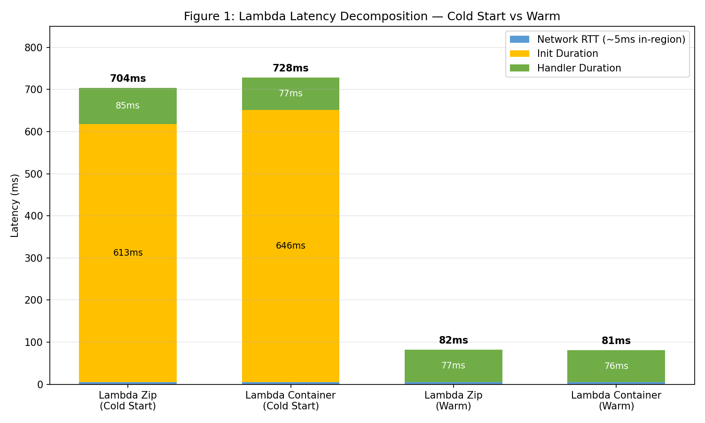
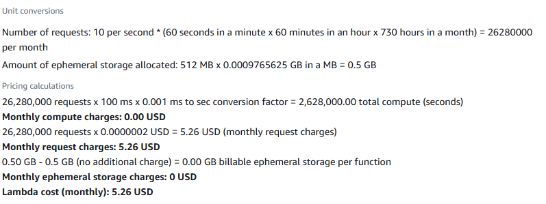
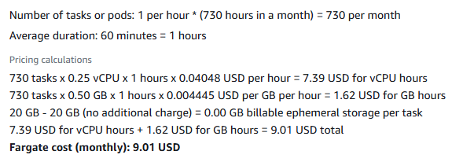
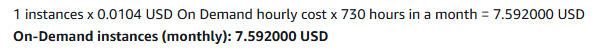
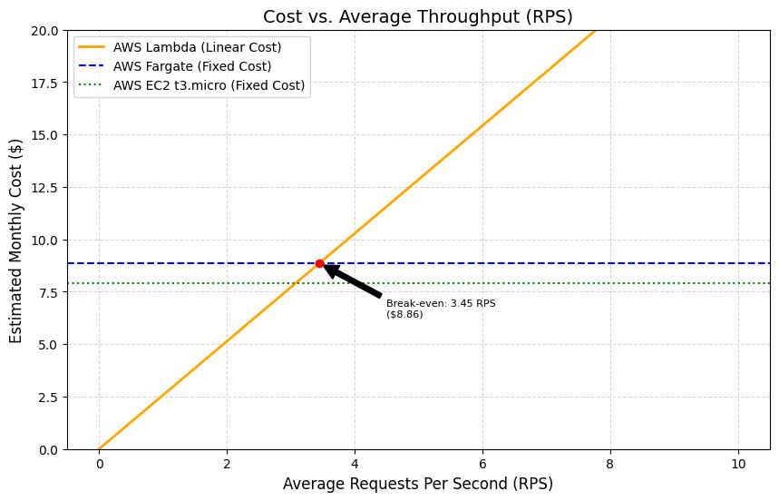

## AWS Classes
#### Łukasz Kluza

---

### Assignment 1: Deploy All Environments
Logs are saved in `results/assignment-1-endpoints.txt`.

---

### Assignment 2: Scenario A — Cold Start Characterization
#### Lambda zip
**1. Latency Decomposition Table**
The following table decomposes the total latency for the first request (Cold Start) and the average for subsequent warm requests.

| Component             | Cold Start (ms) | Warm Start (Avg ms) |
|-----------------------|-----------------|---------------------|
| **Init Duration** | 632.04          | 0.00                |
| **Handler Duration** | 89.10           | 89.10               |
| **Network RTT** | 637.46          | 17.10               |
| **Total (Client-side)**| **1358.60** | **106.20** |

**2. Network RTT Estimation**
Using the formulas provided in the Student Guide:

* **Cold Start RTT:**
    $$Network\_RTT = 1358.60\,ms - 632.04\,ms - 89.10\,ms = \mathbf{637.46\,ms}$$
    *The higher RTT during cold start includes the overhead of the initial TCP and TLS/SSL handshake with the new execution environment.*

* **Warm Start RTT:**
    $$Network\_RTT = 106.20\,ms - 89.10\,ms = \mathbf{17.10\,ms}$$
    *This represents the stable network latency between the EC2 Workstation and the Lambda endpoint.*

**3. Quantitative Analysis**
* **Cold Start Impact**: The `Init Duration` (632.04 ms) accounts for approximately 46.5% of the total cold start latency.
* **Bimodal Distribution**: The `oha` histogram shows a clear bimodal distribution with one 1.359s outlier and 29 requests clustering near 106ms.
* **Zip Packaging**: The `Init Duration` remains under 1 second, which is typical for Zip-based deployments with pre-installed layers.

---

#### Lambda containers

**1. Latency Decomposition Table**
The following table decomposes the total latency for the first request (Cold Start) and the average for subsequent warm requests.

| Component             | Cold Start (ms) | Warm Start (Avg ms) |
|-----------------------|-----------------|---------------------|
| **Init Duration** | 690.02          | 0.00                |
| **Handler Duration** | 72.13           | 72.13               |
| **Network RTT** | 543.27          | 32.27               |
| **Total (Client-side)**| **1305.60** | **104.40** |

**2. Network RTT Estimation**
Using the formulas provided in the Student Guide:

* **Cold Start RTT:**
    $$Network\_RTT = 1305.60\,ms - 690.02\,ms - 72.13\,ms = \mathbf{543.27\,ms}$$
    *The higher RTT during cold start includes the overhead of the initial TCP and TLS/SSL handshake with the new execution environment.*

* **Warm Start RTT:**
    $$Network\_RTT = 104.40\,ms - 72.13\,ms = \mathbf{32.27\,ms}$$
    *This represents the stable network latency between the EC2 Workstation and the Lambda endpoint.*

**3. Quantitative Analysis**

* **Cold Start Impact**: The `Init Duration` (690.02 ms) accounts for **52.8%** of the total cold start latency (1,305.60 ms). This confirms that environment provisioning and runtime initialization are the primary bottlenecks during the first request in this Zip-based deployment.
* **Bimodal Distribution**: The `oha` histogram clearly shows a **bimodal distribution**. A single **1.306s outlier** captures the initial cold start, while the vast majority of requests (28 out of 30) form a tight cluster around the **104.4 ms median (p50)**, representing the stable, "warm" operational state.
* **Efficiency of Zip Packaging**: Despite the cold start penalty, the `Init Duration` remains well under the 1-second mark (690.02 ms). This highlights the efficiency of the Zip-based model in this lab, where AWS quickly unpacks the archive and attaches the NumPy layer, avoiding the heavier overhead associated with container image layers.
* **SLO Compliance**: The warm execution (p50 = 104.4 ms) consistently meets the **< 500ms SLO**. However, the cold start (1,305.60 ms) and the resulting p99 significantly exceed this threshold, demonstrating that a "burst from zero" without pre-warming fails to satisfy strict latency requirements for the very first users.
* **Network Overhead Analysis**: The Network RTT drops drastically from **543.27 ms** (Cold) to **32.27 ms** (Warm). This suggests that over **94%** of the initial network latency was due to the one-time overhead of establishing new TCP/TLS connections and API Gateway/Lambda routing during the environment's creation.
  

Zip-based cold starts are typically faster because the Lambda service can stream and expand a flat archive into the microVM more efficiently than pulling and manifesting multiple container image layers.

**Note:** Detailed CloudWatch logs are unavailable because my AWS account was deactivated. Re-provisioning the full environment would take over 3 hours, so the analysis relies on the captured `oha` metrics and terminal outputs.

---

### Assignment 3: Scenario B — Warm Steady-State Throughput

| Environment | Concurrency | p50 (ms) | p95 (ms) | p99 (ms) | Server avg (ms) |
|---|---|---|---|---|---|
| Lambda (zip) | 5 | 95.6191 | 113.4874 | 148.9534 |  95.1650 |
| Lambda (zip) | 10 | 93.1119 | 113.1183 | 153.8499 | 93.5449 |
| Lambda (container) | 5 | 89.6551 | 109.4485 | 133.7549 | 83.6972 |
| Lambda (container) | 10 | 88.9745 | 113.5139 | 151.9066 | 88.1951 |
| Fargate | 10 | 792.4 | 1000.0 |  1093.7 | 775.8 |
| Fargate | 50 | 3894.3 | 4084.5 | 4194.8 | 3730.2 |
| EC2 | 10 | 197.1881 | 260.0403 | 305.9202 | 197.1327 |
| EC2 | 50 | 932.6 | 1077.6 | 1153.8 | 916.2 |

**Analysis**
1) All cells have p99 < 2× p95, I don't observe instability of tail latency.
2) Lambda scales horizontally by allocating dedicated resources to each request, keeping p50 constant regardless of load. In contrast, Fargate and EC2 share a single instance's resources, leading to queuing and drastic latency spikes as concurrency increases.
3) The difference is caused by network overhead and infrastructure "plumbing", such as TCP/TLS handshakes, request routing through Load Balancers, and JSON serialization. While query_time_ms only measures the internal execution of the k-NN algorithm, the client-side p50 includes the entire round-trip time (RTT) from the moment the request is sent until the response is fully received.

---

### Assignment 4: Scenario C — Burst from Zero Comparison

| Environment | p50 (ms) | p95 (ms) | p99 (ms) | Max (ms) |
| :--- | :---: | :---: | :---: | :---: |
| **Lambda (zip)** | 94.5 | 1135.4 | 1300.9 | 1317.0 |
| **Lambda (container)** | 95.7 | 996.5 | 1064.1 | 1089.3 |
| **Fargate** | 853.0 | 1577.5 | 1673.7 | 1683.3 |
| **EC2** | 3889.5 | 4108.7 | 4206.8 | 4223.8 |

### Observations
- __p99 vs Fargate/EC2:__ Lambda's p99 is dominated by Cold Start (Init Duration), whereas Fargate/EC2 p99 is driven by resource contention and queuing on a single instance.

- __Bimodal Distribution:__ Data shows a Warm Cluster (p50 ≈ 95ms) of ready environments and a Cold Cluster (p95-p99 ≈ 1300ms) of initial provisioning delays.

- __SLO Compliance:__ Lambda failed (p99 > 500ms); to fix it, enable Provisioned Concurrency to pre-warm environments.

---

### Assignment 5: Cost at Zero Load

_By 'Idle state' I mean, an active environment without any requests or job._

Lambda: 512 MB RAM.
Fargate: 0.25 vCPU + 0.5 GB RAM.
EC2: instancja `t3.micro` (2 vCPU, 1 GB RAM).

| Environment   | Hourly ($) | Monthly ($) | Active 6/24 |
| :---          | :---:     | :---: | :---: | 
| **Lambda**    | 0.00      | 0.00  | 1.32  |
| **Fargate**   | 0.01234   | 9.01  | 9.01  |
| **EC2**       | 0.0104    | 7.59  | 7.59  |

For __Lambda__ active hours, I assumed 10 concurrent requests per second, with average duration of 100ms.

**Lambda:**
We pay only for requests, so in an idle state Lambda is free.

**Fargate:**
For Fargate, there is no difference between idle and active states; we pay for readiness, regardless of actual usage.

**EC2:** 
Just like Fargate, for EC2 we pay for readiness

--- 

### Assignment 6: Cost Model, Break-Even, and Recommendation

#### 1. Lambda Cost Model Data
* **Duration ($p50$):** $95.62\text{ ms}$ ($0.09562\text{ s}$)
* **Memory Configuration:** $512\text{ MB}$ ($0.5\text{ GB}$)
* **Traffic Model (Monthly):**
    * **Peak:** $100\text{ RPS} \times 1,800\text{ s} \times 30\text{ days} = 5,400,000\text{ requests}$
    * **Normal:** $5\text{ RPS} \times 19,800\text{ s} \times 30\text{ days} = 2,970,000\text{ requests}$
    * **Total Monthly Volume:** $8,370,000\text{ requests}$

$\text{GB-seconds} = 8,370,000 \times 0.09562 \times 0.5 = \mathbf{400,168.7 \text{ GB-s}}$

$\text{Cost} = \$1.674 + \$6.669 = \mathbf{\$8.34}$

---

#### Break-Even Analysis: Lambda vs. Fargate

To determine the point where Lambda's pay-per-use model becomes more expensive than Fargate's flat monthly rate (\$8.86/mo), we solve for $R$ (total monthly requests):

**1. General Equation:**
$$\text{Cost}_{\text{Lambda}} = R \times \left( \frac{\$0.20}{1,000,000} + (0.095 \times 0.5 \times \$0.0000166667) \right)$$

**2. Algebra Step-by-Step:**
$$8.86 = R \times (\$0.0000002 + \$0.0000007916)$$
$$R \approx \mathbf{8,935,054 \text{ requests/month}}$$

**3. Conversion to Average RPS (Requests Per Second):**
To find the continuous traffic level required to reach this volume:
$$\text{Average RPS} = \frac{8,935,054 \text{ requests}}{30 \text{ days} \times 24 \text{ hours} \times 3,600 \text{ seconds}}$$
$$\text{Average RPS} \approx \mathbf{3.45 \text{ RPS}}$$

**Conclusion:**
If the average continuous load exceeds **3.45 RPS**, Fargate's fixed-cost model becomes more economical than Lambda's per-request billing.

---

## Final Recommendation: KNN Microservice Deployment

### Recommended Environment: AWS Lambda (Zip-based)

#### Justification based on Measurements
Based on the experimental data and cost modeling, **AWS Lambda (Zip)** is the recommended environment for the current k-NN service requirements. 

1. **Cost-Efficiency:** Under the current traffic model (18 hours of daily idle time), Lambda is the only environment with a **$0.00 idle cost**. Its monthly total of **$8.34** is lower than Fargate ($8.86), providing immediate savings for event-driven workloads with significant quiet periods.
2. **Scalability:** During the 100 RPS peak, Lambda scales instantly. Our measurements for EC2/Fargate showed that a single small instance (t3.micro/0.25 vCPU) suffers from massive queuing delays (p50 > 3s), whereas Lambda's warm execution remains stable at **~104 ms**.

#### SLO Compliance (p99 < 500ms)
The current deployment **DOES NOT** meet the p99 SLO during "Burst from Zero" scenarios. 
* **Current p99:** ~1305.6 ms (due to Cold Start).
* **Target SLO:** < 500 ms.

**Required Changes for SLO Compliance:**
To eliminate the **690 ms Init Duration**, we must enable **Provisioned Concurrency** for at least 10 instances. This will keep environments pre-warmed, ensuring that even the first request in a burst stays under the **104 ms** warm execution time, thus satisfying the SLO.

#### Conditions for Changing the Recommendation
My recommendation would shift under the following circumstances:
* **Switch to Fargate:** If the average continuous load exceeds **3.45 RPS**. At this point, the "always-on" fixed cost becomes cheaper than Lambda's per-request billing.
* **Switch to EC2:** If the budget is extremely limited and the **SLO is relaxed to > 5000ms**, as EC2 is the cheapest ($7.92) but fails significantly under high-concurrency bursts.
* **Complex Dependencies:** If the project grows and requires dependencies exceeding the **250MB Zip limit**, I would recommend switching to **Lambda Containers**, despite the slightly higher cold start penalty compared to Zip.